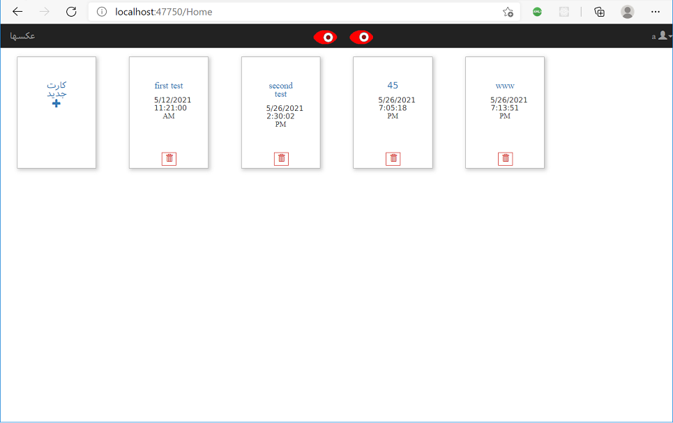

# MVC5.GalleryMaker

a simple sample card postal designer . an old project  :wink: :zany_face:

* zoom in
* zoom out
* undo
* redo
* add text
* add photo
* management of uploaded photo
* management of made cards
* save to database

## cards

## uploaded photos 

## show design card

## properties of added text to card

## properties of added images to card

